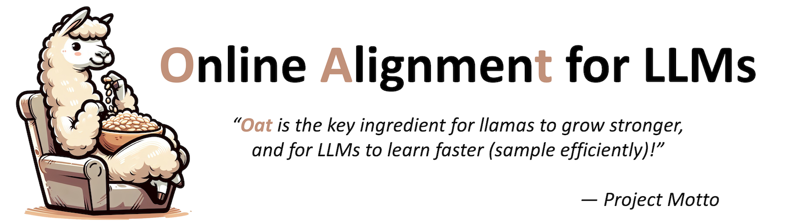
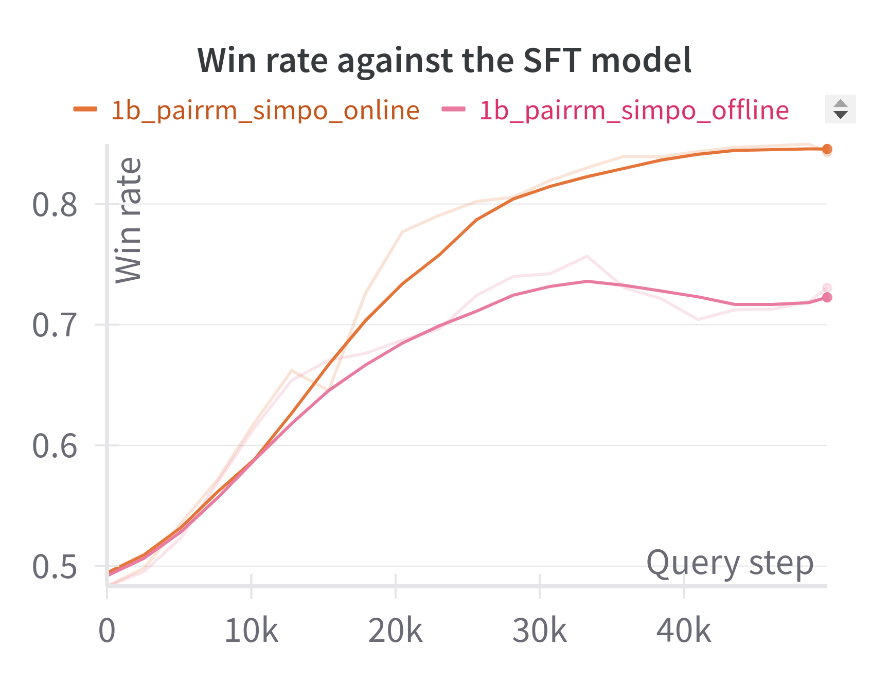
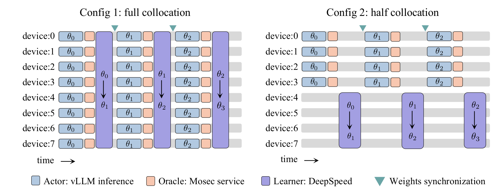
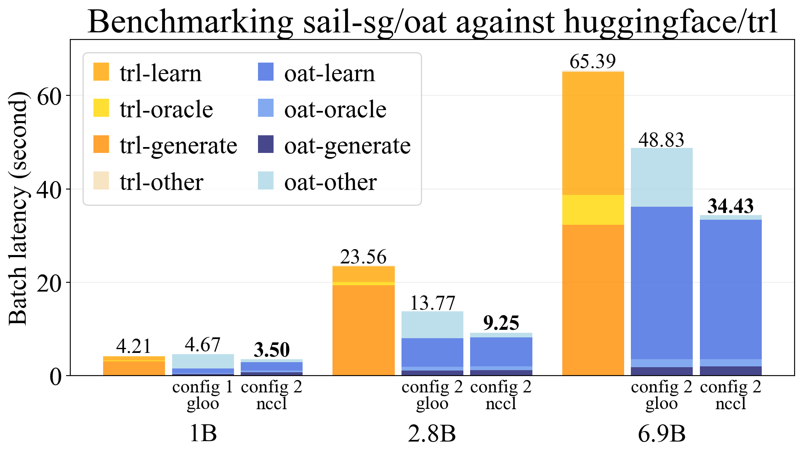

<p align="center">
  
</p>

[](https://pypi.org/project/oat-llm)
[](https://pypi.org/project/oat-llm)

## Introduction
Oat 🌾 is a simple yet efficient system for training online LLM alignment algorithms. Its features include:

* **Highly efficient**: Oat implements a distributed *Actor-Learner-Oracle* architecture, with each component being optimized with state-of-the-art technologies:
  * `Actor` is built with [vLLM](https://github.com/vllm-project/vllm) to accelerate the online response sampling.
  * `Learner` utilizes [DeepSpeed](https://github.com/microsoft/DeepSpeed) ZeRO strategies for enhancing memory-efficiency.
  * `Oracle` is hosted by [Mosec](https://github.com/mosecorg/mosec) as a remote service that supports dynamic request batching, data parallelism and pipeline parallelism.
* **Simplification**: Oat largely simplifies the experimental pipeline of LLM alignment. With the `Oracle` served online, we can flexibly query it for preference data labeling as well as anytime model evaluation. All you need is to launch your experiment and wait for learning curves (e.g., win rate) to be reported to [wandb](https://wandb.ai/lkevinzc/oat-llm). No tedious training, checkpointing and loading for evaluation, etc. Everything happens online!
* **Oracle simulation**: Oat simulates preference oracles in various modes. Lightweight reward models run within the same process, while larger models can be served remotely. You could also query GPT to use LLM-as-a-judge.
* **Easy-to-use**: The modular design of oat allows researchers to simply inherit existing classes and make modifications effortlessly on any of the components to verify new algorithms.
* **State-of-the-art algorithms**: Oat implements state-of-the-art LLM exploration (active alignment) algorithms, including SEA, APL and XPO, along with popular direct optimizers such as DPO and SimPO. This facilitates easier development of new algorithms and fair comparisons.

## Installation :wrench:
In a python environment (`>=3.8, <=3.10`), you can install oat via PyPI:
```console
pip install vllm==0.6.2 && pip install oat-llm
```
Or you could also install in "editable" mode for local development:
```console
git clone git@github.com:sail-sg/oat.git
cd oat
pip install vllm==0.6.2 && pip install -e .
```

## Usage
Here is an example running online SimPO with PairRM as the preference oracle, to align a 1-B Pythia Model on the tl;dr dataset:
```console
python -m oat.experiment.main \
    --total_gpus 2 \
    --collocate \
    --dap_algo SimPO \
    --reward_oracle pairrm \
    --pretrain trl-lib/pythia-1b-deduped-tldr-sft \
    --prompt_data lkevinzc/tldr-with-sft-reference \
    --sync_params_every 1 \
    --train_batch_size 128 \
    --rollout_batch_size 128 \
    --micro_rollout_batch_size 64 \
    --micro_pi_buffer_maxlen 64 \
    --micro_train_batch_size 8 \
    --use_wandb True \
    --wandb_run_name 1b_pairrm_dpo_online
```
which takes less than two hours to run on only two A100 GPUs! We can set `--sync_params_every` a large number to disable policy learner weights synchronization to actors to run an offline SimPO, hence obtaining a comparison result:

<p align="center">
  
</p>

More examples can be found [here](./examples/). 

## Benchmarking
We conducted a system benchmarking to a concurrent implementation of online DPO by [huggingface/trl](https://huggingface.co/docs/trl/main/en/online_dpo_trainer), with the following configurations and results.

<p align="center">
  
</p>

<p align="center">
  
</p>

Please refer to the Appendix C of our paper for detailed benchmarking methods and result discussion.

## License

`oat` is distributed under the terms of the [Apache2](https://www.apache.org/licenses/LICENSE-2.0) license.

## Acknowledgement
We thank the following awesome projects which oat benefits from:
* [vLLM](https://github.com/vllm-project/vllm)
* [DeepSpeed](https://github.com/microsoft/DeepSpeed)
* [Mosec](https://github.com/mosecorg/mosec)
* [OpenRLHF](https://github.com/OpenRLHF/OpenRLHF)

## Disclaimer

This is not an official Sea Limited or Garena Online Private Limited product.